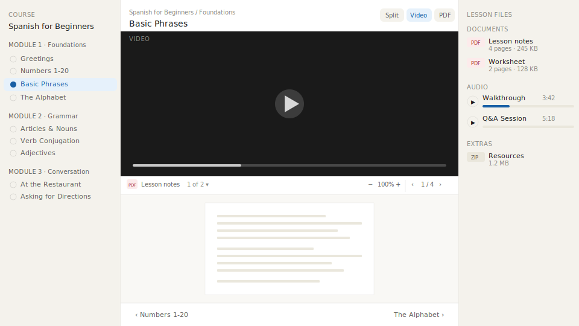

# MediaStudyShelf

A local-first learning tool for video, PDF and audio lessons. Your folder structure is the content model, no CMS, no imports.



## Prerequisites

- Python 3.11+
- Node.js 20.19+
- ffmpeg (provides `ffprobe` for media duration extraction)

## Setup

```bash
# Install Python package (editable, with dev dependencies)
pip install -e ".[dev]"

# Install frontend dependencies
cd client && npm install && cd ..
```

## Development

Run two processes in separate terminals:

```bash
# Terminal 1: Python backend
MEDIASTUDYSHELF_WATCH=1 uvicorn mediastudyshelf.main:app --reload

# Terminal 2: Vite dev server (proxies /api and /media to :8000)
cd client && npm run dev
```

Open the Vite URL (typically http://localhost:5173).

## Production

```bash
# Build the frontend
cd client && npm run build && cd ..

# Run everything from one server
SERVE_FRONTEND=1 uvicorn mediastudyshelf.main:app --host 0.0.0.0 --port 8000
```

Open http://localhost:8000.

## Environment variables

| Variable | Default | Description |
|---|---|---|
| `MEDIASTUDYSHELF_CONTENT_PATH` | `./sample-content` | Path to the content directory |
| `MEDIASTUDYSHELF_WATCH` | off | Set to `1` to re-walk content on filesystem changes (dev mode) |
| `SERVE_FRONTEND` | off | Set to `1` to serve the built frontend from `/client/dist` |

## Content structure

```
/content
  /Course Name/
    course.json                    (optional — override title)
    /Module Name/
      module.json                  (optional — override title)
      /Class Name/
        class.json                 (optional — override title, audio labels, primary PDF)
        video.mp4                  (primary video — first alphabetically)
        lesson.pdf                 (primary PDF — or main.pdf, or first alphabetically)
        worksheet.pdf              (additional PDF)
        walkthrough.mp3            (audio)
        resources.zip              (extras — anything not video/pdf/audio)
```

### Ordering

Folders are sorted using **natural ordering**, so numeric values in names are compared numerically rather than lexicographically. This means you can name your folders however you like and they will sort intuitively:

| Naming style | Sort result |
|---|---|
| `Aula 1`, `Aula 2`, `Aula 10` | 1 → 2 → 10 |
| `01-foundations`, `02-modeling` | 01 → 02 |
| `Módulo 1`, `Módulo 2`, `Módulo 10` | 1 → 2 → 10 |

Folders with an `NN-` prefix (e.g. `01-intro`) have their prefix stripped for display (kebab-case → sentence case). Folders without a prefix are displayed as-is.

### File classification

| Type | Extensions |
|---|---|
| Video | `.mp4`, `.webm`, `.mov` |
| PDF | `.pdf` |
| Audio | `.mp3`, `.m4a`, `.wav`, `.ogg` |
| Extras | everything else |

### Primary PDF resolution

1. `class.json` → `"primary_pdf": "filename.pdf"`
2. A file named `lesson.pdf` or `main.pdf`
3. First PDF alphabetically

## Tests

```bash
pytest
```
